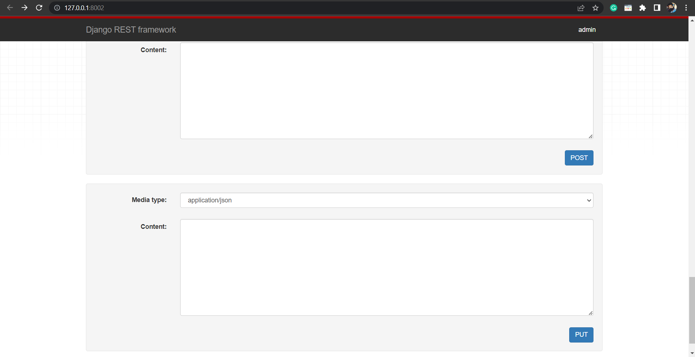
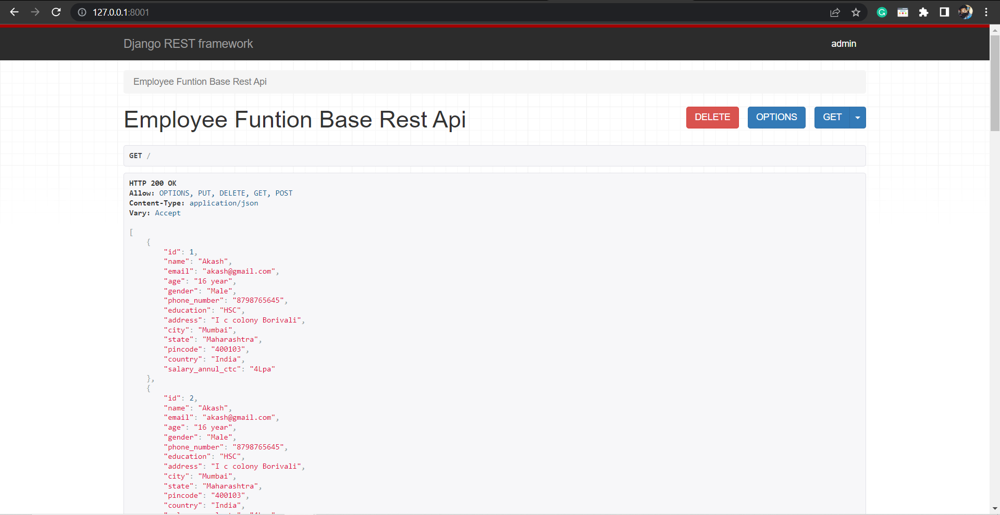
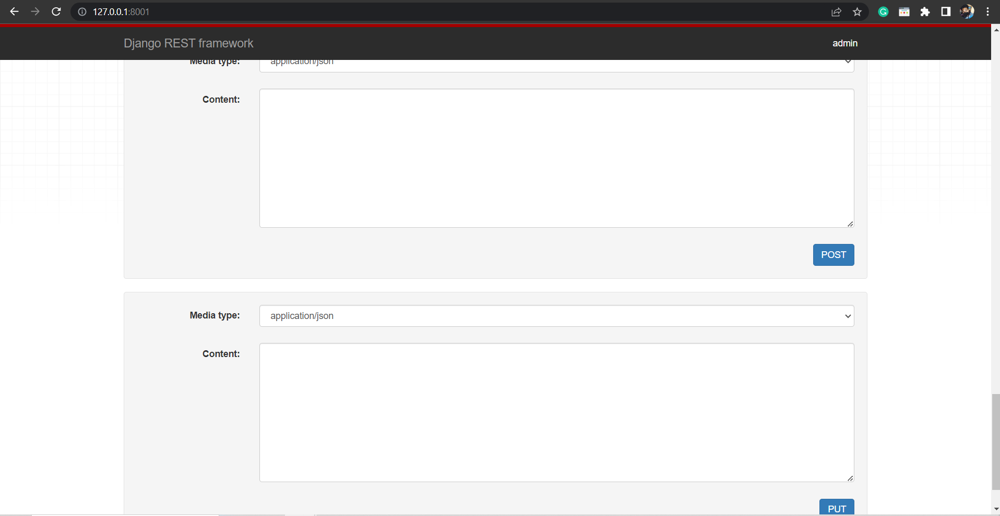
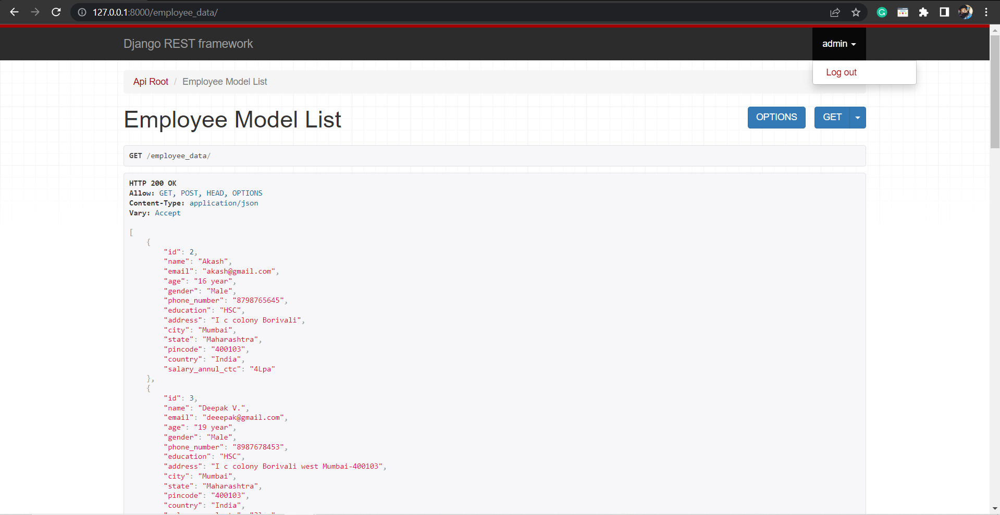
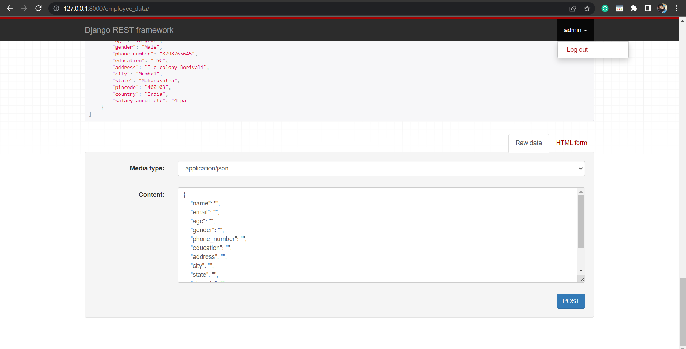

# Class-Based CRUD Operation REST API in Python Django
   * This   Class-Based CRUD (Create, Read, Update, Delete) Operation REST API implemented using Python Django.
   * The API provides endpoints to perform basic CRUD operations on a specific resource using class-based views in Django.

  # Prerequisites
   * Python 3.11.3
   * Django 4.2.1
   * Django REST Framework

     
  # Get All data
   * URL: /localhost:8000/
   * Method: GET
   * Description: Retrieve a list of all data.
   * Response: JSON object containing the  data.
 

 # Create a New data 
   * URL: /localhost:8000/
   * Method: POST
   * Description: Create a new data.
   * Request: JSON object containing the  data.
   * Response: JSON object representing the newly created data
# Update a data
  *  URL: /localhost:8000/<id>/
  *  Method: PUT
  *  Description: Update an existing data.
  * Request: JSON object containing the updated  data.
  * Response: JSON object representing the updated  data.
# Delete a data
* URL: /localhost:8000/<id>/
* Method: DELETE
* Description: Delete an existing data.
* Response: JSON object indicating the success of the deletion.

# Function-Based CRUD Operation REST API in Python Django
   * This  Function-Based CRUD (Create, Read, Update, Delete) Operation REST API implemented using Python Django.
   * The API provides endpoints to perform basic CRUD operations on a specific resource using function-based views in Django
     
  # Get All data
   * URL: /localhost:8000/
   * Method: GET
   * Description: Retrieve a list of all data.
   * Response: JSON object containing the  data.
 

 # Create a New data 
   * URL: /localhost:8000/
   * Method: POST
   * Description: Create a new data.
   * Request: JSON object containing the  data.
   * Response: JSON object representing the newly created data
# Update a data
  *  URL: /localhost:8000/<id>/
  *  Method: PUT
  *  Description: Update an existing data.
  * Request: JSON object containing the updated  data.
  * Response: JSON object representing the updated  data.
# Delete a data
* URL: /localhost:8000/<id>/
* Method: DELETE
* Description: Delete an existing data.
* Response: JSON object indicating the success of the deletion.

#  Login logout model list base REST API in Python Django
  
  # Get All data
   * URL: /localhost:8000/
   * Method: GET
   * Description: Retrieve a list of all data.
   * Response: JSON object containing the  data.
 

 # Create a New data 
   * URL: /localhost:8000/
   * Method: POST
   * Description: Create a new data.
   * Request: JSON object containing the  data.
   * Response: JSON object representing the newly created data

